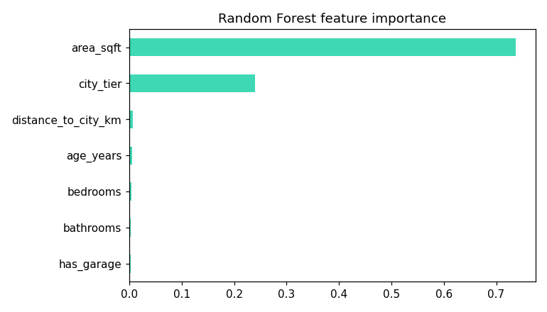
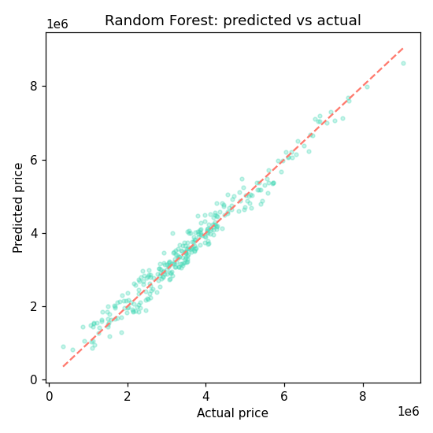
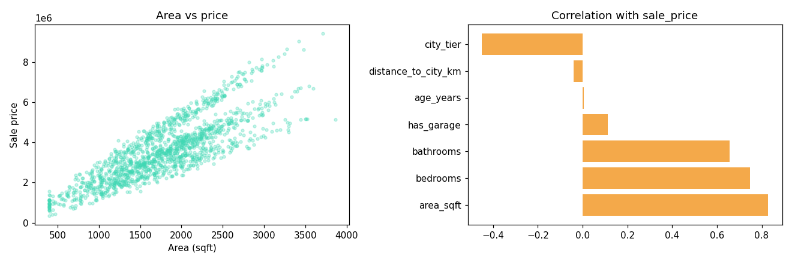

# 🏠 House Price Prediction

> **An end-to-end Machine Learning regression project that predicts residential property prices using housing characteristics such as area, location, property age, and amenities. The project compares Linear Regression and Random Forest Regression to identify the best-performing model and uncover the key factors influencing house prices.**

<p align="center">


</p>

---

# 📌 Project Overview

Accurate property valuation is essential for buyers, sellers, real estate agencies, and financial institutions. This project develops a machine learning regression pipeline to estimate residential property prices using key housing attributes.

The project compares a traditional **Linear Regression** model with a more powerful **Random Forest Regressor**, demonstrating how ensemble learning captures complex, non-linear relationships commonly found in real estate data.

---

# 🎯 Business Problem

Property prices are influenced by numerous factors including location, size, amenities, and market conditions. Manual valuation methods are often inconsistent and time-consuming.

This project aims to:

- Predict residential property prices accurately
- Identify the most influential pricing factors
- Compare linear and non-linear regression models
- Support data-driven pricing decisions

---

# 🛠 Tech Stack

- Python
- Pandas
- NumPy
- Scikit-learn
- Matplotlib
- Jupyter Notebook

---

# 📂 Dataset

**Dataset**

```text
data/house_prices.csv
```

The dataset contains **1,500 synthetic residential property records** generated to simulate realistic housing market behavior with non-linear pricing patterns.

### Features

- Area (sq. ft.)
- Number of Bedrooms
- Number of Bathrooms
- Property Age
- City Tier
- Distance from City Center
- Garage Availability

### Target Variable

```text
Sale Price
```

---

# 📊 Machine Learning Workflow

- Data Exploration
- Exploratory Data Analysis (EDA)
- Correlation Analysis
- Feature Engineering
- Train-Test Split
- Feature Scaling
- Linear Regression Baseline
- Random Forest Regression
- Model Evaluation
- Feature Importance Analysis

---

# 🤖 Models Used

## Linear Regression

Used as a baseline model to understand linear relationships between housing features and sale price.

---

## Random Forest Regressor

An ensemble learning model capable of capturing complex, non-linear interactions between property characteristics, resulting in more accurate price predictions.

---

# 📈 Model Evaluation

Both models are evaluated using multiple regression metrics:

- Root Mean Squared Error (RMSE)
- Mean Absolute Error (MAE)
- R² Score (Coefficient of Determination)

Using multiple evaluation metrics provides a comprehensive assessment of prediction accuracy and model performance.

---

# 📸 Results & Visualizations

## 🔹 Feature Importance

The Random Forest model identifies which housing features have the greatest impact on property prices.

<p align="center">

</p>

---

## 🔹 Predicted vs Actual Prices

This visualization compares the model's predicted prices with the actual sale prices, providing an intuitive measure of prediction accuracy. Points closer to the diagonal indicate stronger model performance.

<p align="center">

</p>

---

## 🔹 Price Drivers Analysis

This exploratory visualization highlights how key variables such as property size, location, and city tier influence house prices, revealing important market trends.

<p align="center">

</p>

---

# 💡 Key Findings

- **Random Forest Regression** consistently outperformed the Linear Regression baseline across RMSE, MAE, and R² metrics.
- **Property Area** is the strongest predictor of house prices.
- **City Tier** significantly influences valuation, with premium locations commanding higher prices.
- Houses located farther from city centers generally have lower market values.
- Property age and available amenities also contribute meaningfully to pricing.
- The non-linear relationships in housing data make ensemble models more effective than traditional linear regression.

---

# 🚀 Business Value

This project demonstrates how machine learning can assist:

- Real Estate Agencies
- Property Developers
- Home Buyers & Sellers
- Financial Institutions
- Mortgage Providers

by providing accurate, data-driven property valuations that improve decision-making and pricing strategies.

---

# 📁 Repository Structure

```text
04-house-price-prediction/
│
├── data/
│   └── house_prices.csv
│
├── notebook.ipynb
├── feature_importance.png
├── pred_vs_actual.png
├── price_drivers.png
├── requirements.txt
└── README.md
```

---

# ▶️ Getting Started

Clone the repository

```bash
git clone https://github.com/NJ024/Data-Science-Portfolio.git
```

Navigate to the project

```bash
cd Data-Science-Portfolio/04-house-price-prediction
```

Install dependencies

```bash
pip install -r requirements.txt
```

Launch Jupyter Notebook

```bash
jupyter notebook notebook.ipynb
```

---

# 📦 Project Outputs

- Exploratory Data Analysis
- Correlation Analysis
- Linear Regression Baseline
- Random Forest Regression Model
- Feature Importance Visualization
- Predicted vs Actual Price Analysis
- Price Drivers Analysis
- Business Recommendations

---

# 🔮 Future Improvements

- Hyperparameter Optimization
- XGBoost and LightGBM Comparison
- Cross-Validation
- SHAP Explainability
- Geospatial Features
- Real Housing Market Dataset Integration
- Streamlit Deployment for Real-Time Price Prediction

---

# 👩‍💻 Author

**Nupur Jaiswal**

📧 **nupurjaiswal931@gmail.com**

💼 **https://linkedin.com/in/nupur-jaiswal**

🐙 **https://github.com/NJ024**

---

## ⭐ Support

If you found this project useful or learned something from it, consider giving this repository a **⭐ Star**.
