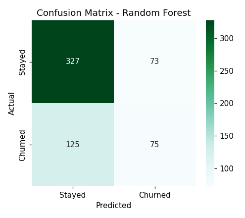
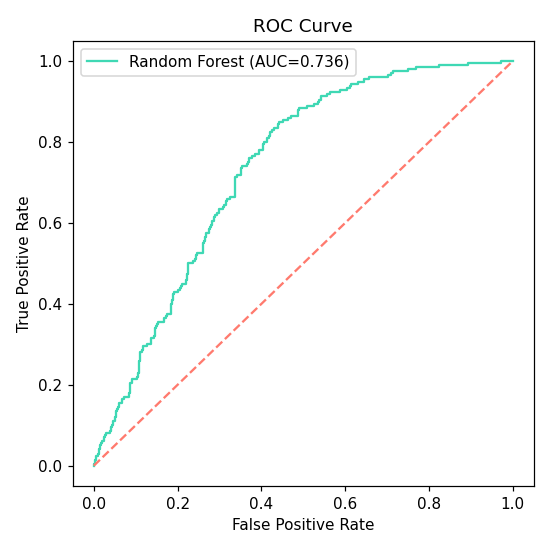
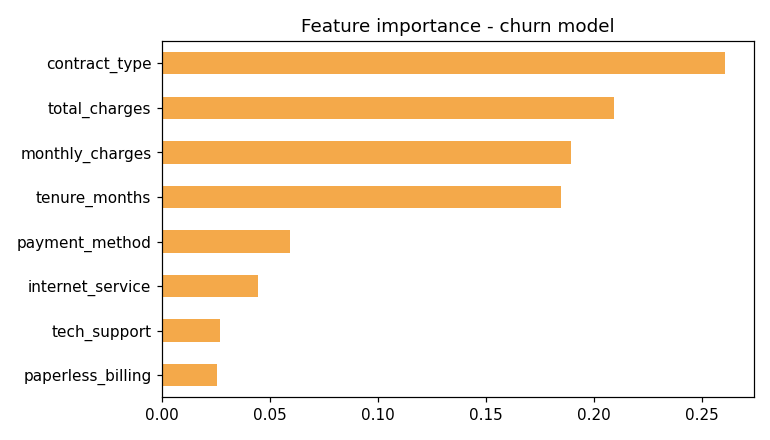

# 📉 Customer Churn Prediction

> **An end-to-end Machine Learning project that predicts telecom customer churn using classification algorithms and deploys the trained model for real-time predictions through Streamlit.**

<p align="center">


</p>

---

# 📌 Project Overview

Customer churn is one of the most important business problems for subscription-based companies. Acquiring a new customer costs significantly more than retaining an existing one, making churn prediction a key use case for machine learning.

This project builds an end-to-end classification pipeline that predicts whether a telecom customer is likely to churn based on demographic information, contract details, billing history, and subscribed services.

The trained model is serialized and reused by the companion **Streamlit application**, allowing business users to generate real-time churn predictions.

---

# 🎯 Business Problem

Telecom companies lose millions in recurring revenue due to customer attrition.

The objective of this project is to:

- Predict customers likely to churn
- Identify factors driving customer attrition
- Enable proactive customer retention
- Support data-driven business decisions

---

# 🛠 Tech Stack

- Python
- Pandas
- NumPy
- Scikit-learn
- Matplotlib
- Joblib
- Jupyter Notebook
- Streamlit

---

# 📂 Dataset

**Dataset**

```text
data/telecom_churn.csv
```

The dataset contains **3,000 synthetic telecom customer records** modeled after common telecom churn datasets.

### Features

- Customer Demographics
- Contract Type
- Tenure
- Monthly Charges
- Internet Service
- Payment Method
- Tech Support
- Online Security
- Paperless Billing
- Partner
- Dependents

### Target

```text
Churn (Yes / No)
```

---

# 📊 Machine Learning Workflow

- Data Cleaning
- Exploratory Data Analysis
- Feature Encoding
- Train-Test Split
- Logistic Regression Baseline
- Random Forest Classifier
- Model Evaluation
- Feature Importance Analysis
- Model Serialization
- Streamlit Deployment

---

# 🤖 Models Used

## Logistic Regression

Baseline classification model used for performance comparison.

## Random Forest

Final production model capable of capturing non-linear relationships and feature interactions, providing improved predictive performance.

---

# 📈 Model Evaluation

Performance is evaluated using:

- Accuracy
- Precision
- Recall
- F1 Score
- Confusion Matrix
- ROC Curve
- ROC-AUC

---

# 📸 Results & Visualizations

## 🔹 Confusion Matrix

The confusion matrix summarizes the model's predictions by comparing the predicted churn labels against the actual outcomes. It highlights correctly classified customers as well as false positives and false negatives.

<p align="center">

</p>

---

## 🔹 ROC Curve

The ROC Curve illustrates the trade-off between the True Positive Rate and False Positive Rate across different classification thresholds. A larger Area Under the Curve (AUC) indicates stronger classification performance.

<p align="center">

</p>

---

## 🔹 Feature Importance

The Random Forest model ranks the features that contribute most to predicting customer churn, enabling business stakeholders to identify the primary drivers of customer attrition.

<p align="center">

</p>

---

# 💡 Key Findings

- Customers with **month-to-month contracts** exhibit the highest churn risk.
- **Customer tenure** is one of the strongest predictors of churn.
- Customers without **Tech Support** or **Online Security** are more likely to leave.
- Long-term contracts significantly improve customer retention.
- The Random Forest model outperforms the Logistic Regression baseline by effectively capturing non-linear relationships within the data.

---

# 🚀 Business Recommendations

- Encourage customers to switch from month-to-month to annual contracts.
- Launch proactive retention campaigns during a customer's first year.
- Bundle Technical Support and Online Security with premium plans.
- Monitor high-risk customers using the deployed prediction model.
- Personalize retention offers based on churn probability.

---

# 📁 Repository Structure

```text
07-customer-churn-prediction/
│
├── data/
│   └── telecom_churn.csv
│
├── notebook.ipynb
├── churn_confusion_matrix.png
├── churn_feature_importance.png
├── churn_roc_curve.png
├── model.pkl
├── requirements.txt
└── README.md
```

---

# ▶️ Getting Started

Clone the repository

```bash
git clone https://github.com/NJ024/Data-Science-Portfolio.git
```

Navigate to the project

```bash
cd Data-Science-Portfolio/07-customer-churn-prediction
```

Install dependencies

```bash
pip install -r requirements.txt
```

Launch Jupyter Notebook

```bash
jupyter notebook notebook.ipynb
```

Running the notebook trains the model, evaluates its performance, and generates a serialized **model.pkl** file that is reused by the companion **Streamlit deployment**.

---

# 📦 Project Outputs

- Cleaned Dataset
- Exploratory Data Analysis
- Logistic Regression Baseline
- Random Forest Model
- Confusion Matrix
- ROC Curve
- Feature Importance
- Serialized Model (`model.pkl`)
- Business Recommendations

---

# 🔮 Future Improvements

- Hyperparameter Optimization
- Cross Validation
- XGBoost Comparison
- LightGBM Comparison
- SHAP Explainability
- Model Monitoring Dashboard
- Automated Retraining Pipeline

---

# 👩‍💻 Author

**Nupur Jaiswal**

📧 **nupurjaiswal931@gmail.com**

💼 **https://linkedin.com/in/nupur-jaiswal**

🐙 **https://github.com/NJ024**

---

## ⭐ Support

If you found this project helpful, consider giving this repository a **⭐ Star**.
