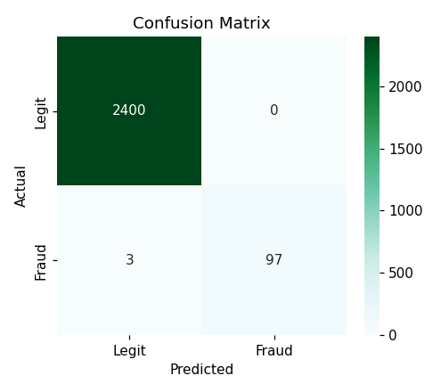
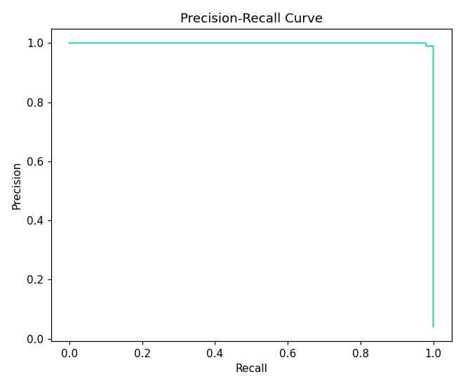
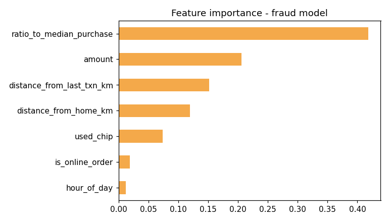

# 💳 Credit Card Fraud Detection

> **An end-to-end Machine Learning project that detects fraudulent credit card transactions using classification models designed for highly imbalanced datasets. The project focuses on precision, recall, F1-score, and Precision-Recall AUC to identify fraudulent transactions while minimizing false positives.**

<p align="center">


</p>

---

# 📌 Project Overview

Credit card fraud is one of the most challenging machine learning applications due to the extreme imbalance between legitimate and fraudulent transactions. Traditional evaluation metrics such as accuracy can be misleading, as a model predicting every transaction as legitimate may still achieve very high accuracy while failing to detect any fraud.

This project develops a fraud detection pipeline using **Random Forest Classification** with class balancing techniques and evaluates the model using metrics specifically suited for imbalanced classification problems.

---

# 🎯 Business Problem

Financial institutions process millions of transactions every day, making manual fraud detection impractical.

The objectives of this project are to:

- Detect fraudulent transactions accurately
- Minimize financial losses
- Reduce false alarms
- Identify key fraud indicators
- Support real-time fraud prevention systems

---

# 🛠 Tech Stack

- Python
- Pandas
- NumPy
- Scikit-learn
- Matplotlib
- Jupyter Notebook

---

# 📂 Dataset

**Dataset**

```text
data/transactions.csv
```

The dataset contains **10,000 synthetic credit card transactions**, designed to mimic real-world fraud patterns.

### Dataset Summary

- **Total Transactions:** 10,000
- **Legitimate Transactions:** 9,600
- **Fraudulent Transactions:** 400
- **Fraud Rate:** ~4%

### Features

- Transaction Amount
- Distance From Home
- Ratio to Median Purchase
- Chip Usage
- Online Transaction
- Card Present Indicator
- Merchant Category
- Additional behavioral features

### Target Variable

```text
Fraud (Yes / No)
```

---

# 📊 Machine Learning Workflow

- Data Exploration
- Class Imbalance Analysis
- Exploratory Data Analysis
- Stratified Train-Test Split
- Baseline Model Evaluation
- Random Forest Classification
- Class Weight Balancing
- Threshold Optimization
- Model Evaluation
- Feature Importance Analysis

---

# 🤖 Model

## Random Forest Classifier

A Random Forest classifier was trained using:

- Stratified train-test split
- `class_weight='balanced'`
- Feature importance analysis
- Probability threshold tuning

This approach enables the model to better recognize the minority fraud class without relying on oversampling techniques.

---

# 📈 Model Evaluation

Because fraud detection is an **imbalanced classification problem**, the project focuses on metrics that better reflect real-world performance instead of overall accuracy.

### Evaluation Metrics

- Precision
- Recall
- F1 Score
- Confusion Matrix
- ROC-AUC
- Precision-Recall Curve
- Average Precision (PR-AUC)

---

# 📸 Results & Visualizations

## 🔹 Confusion Matrix

The confusion matrix summarizes the model's predictions by comparing detected fraud with actual fraudulent transactions, helping evaluate false positives and false negatives.

<p align="center">

</p>

---

## 🔹 Precision-Recall Curve

The Precision-Recall Curve provides a more informative evaluation than ROC-AUC for highly imbalanced datasets. It illustrates the trade-off between identifying fraudulent transactions and minimizing false alarms across different classification thresholds.

<p align="center">

</p>

---

## 🔹 Feature Importance

The Random Forest model highlights the variables that contribute most to fraud prediction, allowing analysts to better understand suspicious transaction behavior.

<p align="center">

</p>

---

# 💡 Key Findings

- **Ratio to Median Purchase** is one of the strongest indicators of fraudulent activity.
- Transactions occurring **far from a customer's usual location** exhibit significantly higher fraud risk.
- Large transaction amounts combined with unusual purchasing behavior increase fraud probability.
- Using **class-balanced learning** substantially improves fraud detection compared to a naïve classifier.
- Precision-Recall metrics provide a more reliable assessment of model performance than overall accuracy for highly imbalanced datasets.

---

# 🚀 Business Value

This project demonstrates how machine learning can strengthen fraud prevention by:

- Detecting suspicious transactions before financial losses occur.
- Reducing manual investigation efforts.
- Improving risk management through data-driven fraud scoring.
- Supporting real-time transaction monitoring systems.
- Providing interpretable insights into fraud-driving factors.

---

# 📁 Repository Structure

```text
08-credit-card-fraud-detection/
│
├── data/
│   └── transactions.csv
│
├── notebook.ipynb
├── fraud_confusion_matrix.png
├── fraud_feature_importance.png
├── precision_recall_curve.png
├── requirements.txt
└── README.md
```

---

# ▶️ Getting Started

Clone the repository

```bash
git clone https://github.com/NJ024/Data-Science-Portfolio.git
```

Navigate to the project

```bash
cd Data-Science-Portfolio/08-credit-card-fraud-detection
```

Install dependencies

```bash
pip install -r requirements.txt
```

Launch Jupyter Notebook

```bash
jupyter notebook notebook.ipynb
```

---

# 📦 Project Outputs

- Class Imbalance Analysis
- Exploratory Data Analysis
- Baseline Model Comparison
- Random Forest Fraud Detection Model
- Confusion Matrix
- Precision-Recall Curve
- Feature Importance Analysis
- Business Recommendations

---

# 🔮 Future Improvements

- XGBoost and LightGBM Comparison
- Hyperparameter Optimization
- SHAP Explainability
- Cost-Sensitive Learning
- Anomaly Detection Models
- Real-Time Fraud Detection API
- Streamlit Dashboard for Live Predictions

---

# 👩‍💻 Author

**Nupur Jaiswal**

📧 **nupurjaiswal931@gmail.com**

💼 **https://linkedin.com/in/nupur-jaiswal**

🐙 **https://github.com/NJ024**

---

## ⭐ Support

If you found this project useful or learned something from it, consider giving this repository a **⭐ Star**.
